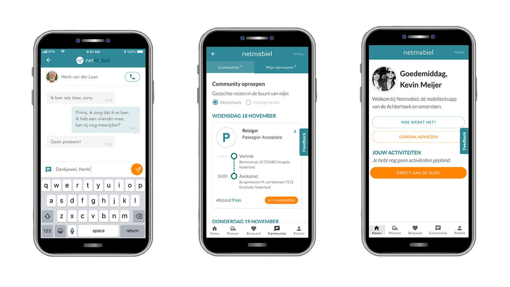
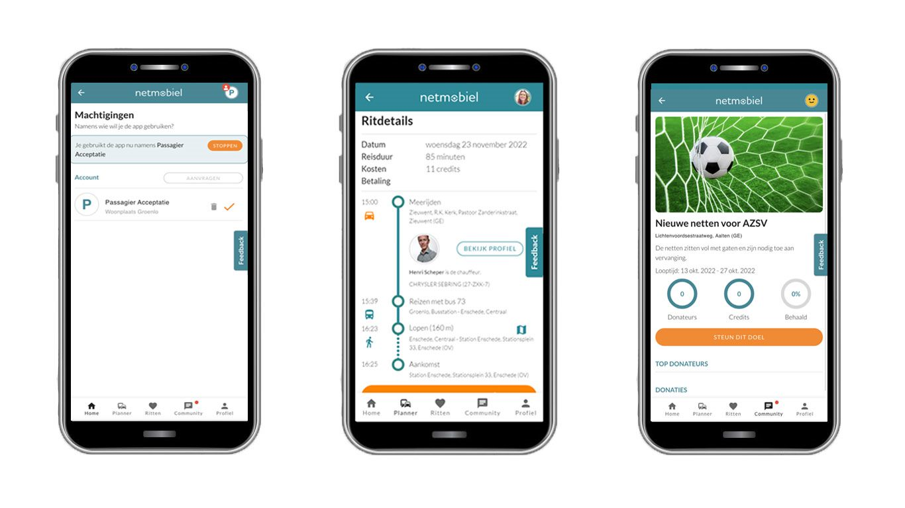

# netmobiel-vue-client

The Netmobiel Vue Client is the front-end of the Netmobiel Mobility-as-a-Service System. The main documentation of Netmobiel is in the [Netmobiel platform project](https://github.com/SaxionSmartCities/netmobiel-platform).

The front-end written for Netmobiel is (mainly) a reactive HTML5 application written in [Vue 2](https://v2.vuejs.org/). For integration with the Firebase messaging a real app was required. For ease of development we used a [Flutter application](https://github.com/SaxionSmartCities/netmobiel-flutter-client) to have a single source and generate from there an Android as well as an iOS app. On desktop the web application can be used directly in any modern browser, without support for push notifications though. 



The Netmobiel Project (also named Netmobil) was a Dutch RAAK-Pro project (RAAK.PRO02.093) managed by the Saxion research group [Smart Cities](https://www.saxion.nl/onderzoek/smart-industry/smart-cities) during the period 2017-2022. The purpose of the project was to create a Mobility-as-a-Services system for rural areas. The selected pilot region was the Achterhoek region, in the east of Gelderland, The Netherlands. The requirements, both for features and user interface, were drawn up together with people from the selected communities in the targeted area. Prototypes were also tested in the same communities. 

Some features in Metmobiel:
* Multimodal planner combines public transport and rideshare (carpool)
* Dedicated carpool service
* Shout-out to let other people know you wish a ride
* Embedded chat service
* Support for delegation by caregivers
* Integrated incentive and reward model



## Project setup
```
npm install
```

## Configuration
For local testing, copy the file `.env.local.template` to `.env.local` and update the value of the variables.

The frontend uses [Keycloak](https://www.keycloak.org) for authentication. You have to deploy your own Keycloak server. Refer to [Netmobiel platform project](https://github.com/SaxionSmartCities/netmobiel-platform) for more information about the configuration of Keycloak. In a [separate project](https://github.com/SaxionSmartCities/netmobiel-keycloak) we modified the look and feel of Keycloak a bit to integrate it with the front-end. 

### Compiles and hot-reloads for development
Use the command defined in `package.json`
```
npm run serve
```

### Compiles and minifies for production
```
npm run build
```
### Lints and fixes files
```
npm run lint
```

For production settings run:
```
npm run lint-prod
```

### Deployment
During the Netmobiel project we used the Continuous Integration feature offered by GitLab. Quite convenient, highly recommended.


### Customize configuration
See [Configuration Reference](https://cli.vuejs.org/config/).
